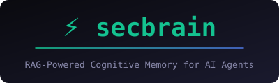
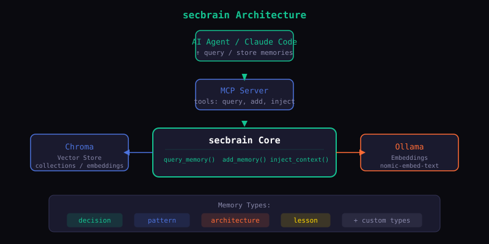

<p align="center">
  
</p>

<p align="center">
  
  
  
  
  
</p>

<p align="center">
  <a href="https://www.linkedin.com/in/vasiliskolyvasmsc" target="_blank"></a>
  <a href="https://github.com/onchain3r/secbrain" target="_blank"></a>
</p>

<p align="center">
  <strong>RAG-based cognitive memory system for AI agents — persistent, retrievable knowledge layer powered by Chroma, Ollama, and MCP.</strong>
</p>

<p align="center">
  <a href="#quick-start">Quick Start</a>
  ·
  <a href="#architecture">Architecture</a>
  ·
  <a href="#core-components">Components</a>
  ·
  <a href="#usage">Usage</a>
  ·
  <a href="#mcp-server">MCP Server</a>
  ·
  <a href="#contributing">Contributing</a>
</p>

---

## What Is This?

secbrain is a **retrieval-augmented memory system** that gives AI coding agents persistent, queryable knowledge.

Store decisions, patterns, architecture notes, and lessons — then retrieve them naturally when context is relevant during coding sessions.

- **Semantic Search** — Query memories by meaning, not keywords
- **Local-First** — Runs entirely on your machine via Ollama + Chroma
- **MCP Integration** — Native tool calling for Claude Code
- **Structured Memory** — Typed slots: decision, pattern, architecture, lesson

---

## Quick Start

### Prerequisites

- Python 3.10+
- [Ollama](https://ollama.ai/) installed and running

### Install

```bash
git clone https://github.com/onchain3r/secbrain.git
cd secbrain
pip install -e .
```

### Pull Embedding Model

```bash
ollama pull nomic-embed-text
```

### Verify

```bash
python -c "from secbrain import SecBrain; sb = SecBrain(); print('secbrain ready')"
```

---

## Architecture

<p align="center">
  
</p>

secbrain sits between your AI agent and a local vector store. The MCP server exposes memory operations as tools, while Ollama generates embeddings and Chroma handles storage and similarity search.

---

## Core Components

### Chroma Vector Store
Persistent embeddings storage with collection management for fast similarity search.

### Ollama Embeddings
Local embedding generation via `nomic-embed-text` — no API keys, no costs.

### MCP Server
Model Context Protocol server exposing memory tools to Claude Code.

### Memory Types
Structured slots for different knowledge categories:

| Type | Use Case |
|------|----------|
| `decision` | Architectural choices, tool selections |
| `pattern` | Reusable code patterns, solutions |
| `architecture` | System design, component relationships |
| `lesson` | Hard-won insights, gotchas |

---

## Usage

### Python API

```python
from secbrain import SecBrain

sb = SecBrain()

# Store a memory
sb.add_memory(
    title="Use Chroma for vector storage",
    content="Chroma provides fast, local embeddings with a clean API. Best for self-hosted RAG.",
    memory_type="decision",
    tags=["storage", "rag", "chroma"],
)

# Query by meaning
results = sb.query_memory("embedding storage options", top_k=5)
for r in results:
    print(f"[{r['memory_type']}] {r['title']} — {r['distance']:.3f}")
```

### Query by Type

```python
# Get all decisions
decisions = sb.get_memories_by_type("decision")

# Collection stats
stats = sb.get_memory_stats()
print(f"Total: {stats['total']} | Decisions: {stats['by_type'].get('decision', 0)}")
```

### Inject Context into Prompts

```python
context = sb.inject_context(
    query="How did we handle auth in past projects?",
    session_context="building a new webapp with JWT",
    top_k=3,
)
# Returns formatted string to inject into LLM prompts
```

### CLI

```bash
secbrain                 # Interactive query mode
secbrain add             # Add memory via CLI
secbrain stats           # Show memory stats
secbrain list            # List all memories
```

## How to Use

### CLI Commands

| Command | Description |
|---------|-------------|
| `pip install -e .` | Install secbrain as editable package |
| `ollama pull nomic-embed-text` | Pull the embedding model for Ollama |
| `python -c "from secbrain import SecBrain; sb = SecBrain(); print('secbrain ready')"` | Verify installation |
| `secbrain` | Interactive query mode |
| `secbrain add` | Add memory via CLI |
| `secbrain stats` | Show memory statistics |
| `secbrain list` | List all memories |
| `secbrain mcp` | Start MCP server (stdio transport) |
| `secbrain mcp --transport http --host 0.0.0.0 --port 8765` | Start MCP server (HTTP/SSE transport) |

### MCP Tools (via Claude Code)

| Tool | Description |
|------|-------------|
| `secbrain_query_memory` | Semantic search across memories |
| `secbrain_add_memory` | Store new memories |
| `secbrain_get_memories_by_type` | Filter by memory type (decision/pattern/architecture/lesson) |
| `secbrain_get_memory_stats` | Collection statistics |
| `secbrain_inject_context` | Generate prompt-ready context blocks |

### Memory Types

| Type | Use Case |
|------|----------|
| `decision` | Architectural choices, tool selections |
| `pattern` | Reusable code patterns, solutions |
| `architecture` | System design, component relationships |
| `lesson` | Hard-won insights, gotchas |

---

## MCP Server

The MCP server exposes secbrain as Model Context Protocol tools for Claude Code.

```bash
# Start MCP server
secbrain mcp

# Or run directly
python -m secbrain.mcp_server
```

Available tools:
- `secbrain_query_memory` — Semantic search across memories
- `secbrain_add_memory` — Store new memories
- `secbrain_get_memories_by_type` — Filter by memory type
- `secbrain_get_memory_stats` — Collection statistics
- `secbrain_inject_context` — Generate prompt-ready context blocks

---

## Contributing

Contributions welcome — new memory types, retrieval improvements, bug fixes.

1. Fork the repository
2. Create a feature branch (`git checkout -b feature/my-feature`)
3. Commit your changes
4. Push and open a Pull Request

---

## Acknowledgments

Built with:
- [Chroma](https://github.com/chroma-core/chroma) — vector database
- [Ollama](https://ollama.ai/) — local LLM inference
- [MCP](https://modelcontextprotocol.io/) — model context protocol